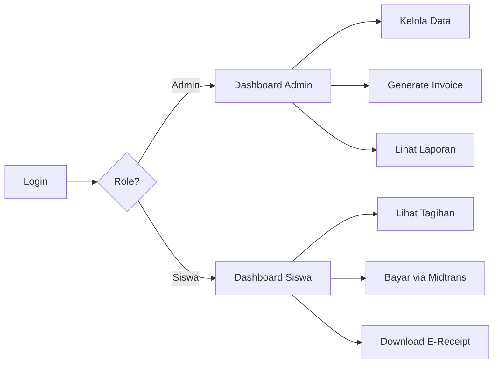

# 🏫 SchoolPay - Sistem Pembayaran Sekolah


Aplikasi manajemen pembayaran sekolah yang **efisien**, **transparan**, dan **terintegrasi** dengan fitur dashboard, notifikasi, e-receipt, laporan keuangan, integrasi Midtrans, serta chatbot AI.

---

## 📋 Daftar Isi

- [Fitur Utama](#-fitur-utama)
- [Tech Stack](#-tech-stack)
- [Struktur Proyek](#-struktur-proyek)
- [Prasyarat](#-prasyarat)
- [Instalasi](#-instalasi)
- [Menjalankan Aplikasi](#-menjalankan-aplikasi)
- [Konfigurasi](#-konfigurasi)
- [Penggunaan](#-penggunaan)
- [API Endpoints](#-api-endpoints)
- [Kontribusi](#-kontribusi)
- [Lisensi](#-lisensi)

---

## ✨ Fitur Utama

### 👨‍💼 Admin/Bendahara
- ✅ Dashboard ringkas (pemasukan harian, total tunggakan)
- ✅ Manajemen data siswa & kelas
- ✅ Master kategori pembayaran & tarif
- ✅ Generate invoice otomatis (SPP bulanan, dll)
- ✅ Buat invoice event insidental
- ✅ Laporan keuangan (kas harian, per kategori, tunggakan)
- ✅ Export laporan ke Excel
- ✅ Audit log perubahan data

### 👨‍👩‍👧 Siswa/Orang Tua
- ✅ Dashboard tagihan (status PAID/UNPAID/PARTIAL)
- ✅ Detail tagihan dengan item breakdown
- ✅ Riwayat transaksi lengkap
- ✅ Unduh/lihat e-receipt
- ✅ Pembayaran online via Midtrans
- ✅ Chatbot AI untuk cek tunggakan & informasi

### 🤖 Chatbot AI
- ✅ Cek tunggakan SPP
- ✅ Cek invoice belum dibayar
- ✅ Minta informasi jatuh tempo
- ✅ Minta bukti pembayaran terakhir
- ✅ Rekap pendapatan (untuk admin)

### 🔐 Keamanan
- ✅ Role-based access control (Admin, Bendahara, Wali Kelas, Siswa, Orang Tua)
- ✅ Wajib ganti password saat login pertama
- ✅ Webhook verification (Midtrans signature)

---

## 🛠 Tech Stack

| Komponen | Teknologi |
|----------|-----------|
| **Backend** | Laravel 10 (PHP 8.1+) |
| **Frontend** | Flutter Web |
| **Database** | SQLite + DrizzleORM |
| **Payment Gateway** | Midtrans (Snap + Webhook) |
| **DB Management** | Drizzle Studio |

---

## 📁 Struktur Proyek

```
SchoolPay/
├── school-payment-api/     # Laravel Backend API
│   ├── app/
│   │   ├── Http/Controllers/
│   │   ├── Models/
│   │   └── Services/
│   ├── database/
│   │   ├── migrations/
│   │   └── database.sqlite
│   ├── routes/
│   │   └── api.php
│   └── ...
│
├── school-payment-app/     # Flutter Web Frontend
│   ├── lib/
│   │   ├── models/
│   │   ├── providers/
│   │   ├── screens/
│   │   ├── services/
│   │   └── widgets/
│   ├── web/
│   └── ...
│
└── README.md
```

---

## 📦 Prasyarat

Pastikan Anda sudah menginstall:

| Software | Versi Minimum | Link Download |
|----------|---------------|---------------|
| **PHP** | 8.1+ | [php.net](https://www.php.net/downloads) |
| **Composer** | 2.x | [getcomposer.org](https://getcomposer.org/download/) |
| **Node.js** | 18+ | [nodejs.org](https://nodejs.org/) |
| **Flutter** | 3.x | [flutter.dev](https://flutter.dev/docs/get-started/install) |
| **Git** | Latest | [git-scm.com](https://git-scm.com/downloads) |

### Verifikasi Instalasi

```bash
php --version
composer --version
node --version
flutter --version
git --version
```

---

## 🚀 Instalasi

### 1. Clone Repository

```bash
git clone https://github.com/JordanZ157/SchoolPay.git
cd SchoolPay
```

### 2. Setup Backend (school-payment-api)

```bash
# Masuk ke folder API
cd school-payment-api

# Install PHP dependencies
composer install

# Copy file konfigurasi
cp .env.example .env

# Generate application key
php artisan key:generate

# (Opsional) Jika ingin database baru, hapus database.sqlite lalu:
# touch database/database.sqlite
# php artisan migrate --seed

# Install Node dependencies (untuk Drizzle Studio)
npm install
```

### 3. Setup Frontend (school-payment-app)

```bash
# Masuk ke folder App
cd ../school-payment-app

# Install Flutter dependencies
flutter pub get
```

---

## ▶ Menjalankan Aplikasi

### Terminal 1: Backend API

```bash
cd school-payment-api
php artisan serve
```

Backend akan berjalan di: `http://127.0.0.1:8000`

### Terminal 2: Flutter Web

```bash
cd school-payment-app
flutter run -d chrome
```

Frontend akan terbuka di browser.

### (Opsional) Terminal 3: Drizzle Studio

```bash
cd school-payment-api
npm run studio
```

Drizzle Studio akan berjalan di: `https://local.drizzle.studio`

---

## ⚙ Konfigurasi

### File `.env` (school-payment-api)

Buat file `.env` dari template `.env.example` dan sesuaikan:

```env
APP_NAME="School Payment System"
APP_ENV=local
APP_DEBUG=true
APP_URL=http://localhost:8000

# Database
DB_CONNECTION=sqlite
DB_DATABASE=database/database.sqlite

# Midtrans (Sandbox untuk testing)
MIDTRANS_SERVER_KEY=your_server_key
MIDTRANS_CLIENT_KEY=your_client_key
MIDTRANS_IS_PRODUCTION=false
MIDTRANS_IS_SANITIZED=true
MIDTRANS_IS_3DS=true
```

### Mendapatkan API Key Midtrans

1. Daftar di [Midtrans Dashboard](https://dashboard.midtrans.com/)
2. Pilih **Sandbox** untuk testing
3. Copy **Server Key** dan **Client Key**
4. Paste ke file `.env`

---

## 📖 Penggunaan

### Default Credentials

| Role | Username | Password |
|------|----------|----------|
| Admin | admin@school.com | 123456 |
| Bendahara | bendahara@school.com | 123456 |
| Siswa | (NIS siswa) | 123456 |

> ⚠️ **Penting:** Password default adalah `123456`. Sistem akan meminta ganti password saat login pertama.

### Alur Penggunaan



---

## 🔌 API Endpoints

### Authentication
| Method | Endpoint | Deskripsi |
|--------|----------|-----------|
| POST | `/api/login` | Login user |
| POST | `/api/logout` | Logout user |
| GET | `/api/me` | Get current user |

### Invoices
| Method | Endpoint | Deskripsi |
|--------|----------|-----------|
| GET | `/api/invoices` | List all invoices |
| GET | `/api/invoices/{id}` | Get invoice detail |
| POST | `/api/invoices/generate` | Generate bulk invoices |
| POST | `/api/pay/{invoice_id}` | Create payment (Midtrans) |

### Reports
| Method | Endpoint | Deskripsi |
|--------|----------|-----------|
| GET | `/api/reports/daily` | Laporan harian |
| GET | `/api/reports/category` | Laporan per kategori |
| GET | `/api/reports/arrears` | Laporan tunggakan |

### Webhook
| Method | Endpoint | Deskripsi |
|--------|----------|-----------|
| POST | `/api/midtrans/callback` | Midtrans webhook handler |

### Chatbot
| Method | Endpoint | Deskripsi |
|--------|----------|-----------|
| POST | `/api/chatbot/message` | Send chat message |

---

## 🤝 Kontribusi

1. Fork repository ini
2. Buat branch fitur (`git checkout -b feature/FiturBaru`)
3. Commit perubahan (`git commit -m 'Menambahkan FiturBaru'`)
4. Push ke branch (`git push origin feature/FiturBaru`)
5. Buat Pull Request

---

## 📄 Lisensi

Proyek ini dibuat untuk keperluan akademik/skripsi.

---

## 📞 Kontak

- **Developer:** Jordan Z
- **GitHub:** [@JordanZ157](https://github.com/JordanZ157)

---

<p align="center">
  Made with ❤️ for Indonesian Schools
</p>
